# ESP32-S3 based NMEA2000 Display with Autopilot and Alarm Handling

  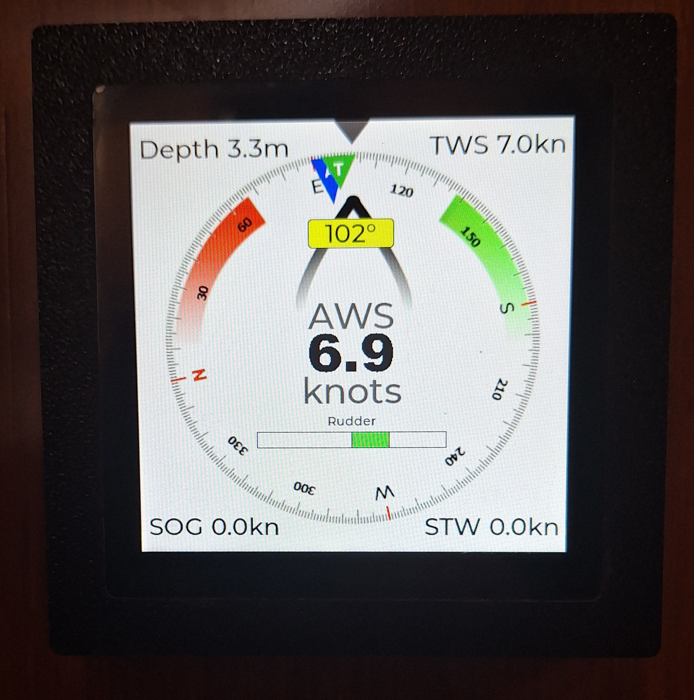

Based on work by Homberger and Timo Lappalainen.

A DIY NMEA2000 display for the Waveshare ESP32-S3-Touch-LCD-4, with autopilot support, alarm handling, and a touchscreen user interface designed as an affordable replacement for older marine displays such as the Raymarine ST70.

> **☕ If this project helps you, you're welcome to support it here:** [Buy Me a Coffee](https://buymeacoffee.com/francissailor)  
> Even a small contribution helps me keep improving the project. I am using the funding to develop a watertight and sunlight readable screen as to be able to use it outdoors / in the cockpit. 

## What to Expect

- A fully working NMEA2000 display comparable to some commercial displays
- No soldering required: just connect the NMEA2000 wires and the power wires to the terminal block
- A 3D-printable housing with the same mounting-hole pattern as an ST70 instrument
- Compatibility with Raymarine Evolution autopilot modes
- Display and acknowledgement of autopilot-related alarms
- Configurable units (knots, km/h, m/s, ft, m, and more) through a settings screen
- Settings stored in flash memory

## What Not to Expect

- The display is **not bright enough for comfortable outdoor use** in full sun (about 350 nits)
- The display is **not ruggedized** for outdoor use
- The housing is **not watertight** and is not designed for outdoor exposure

I am still hoping that Waveshare will eventually offer a higher-brightness version of this board. If that would also help your use case, please consider asking them for a high-nit version of the **ESP32-S3-Touch-LCD-4** through their support page on the Waveshare wiki.

## Hardware Required

- **Waveshare ESP32-S3-Touch-LCD-4, Version 4**
- An **NMEA2000 cable** compatible with your boat network  
  In my case, I used a **Raymarine Spur cable**

### Note on Version 3 boards

I have included a flash file for Version 3 boards, but not the full source package. I can provide the Version 3 source files on request. Some functionality is limited on Version 3 boards:

- No backlight control
- Power-up is not automatic; you need to use the power key
- I also do not plan further updates to the V3 version anymore !!

## Screenshots

  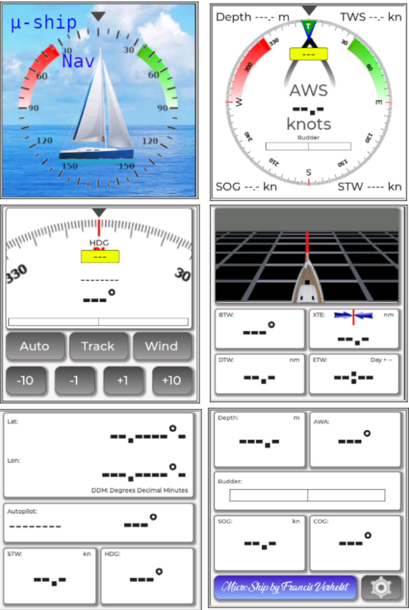

  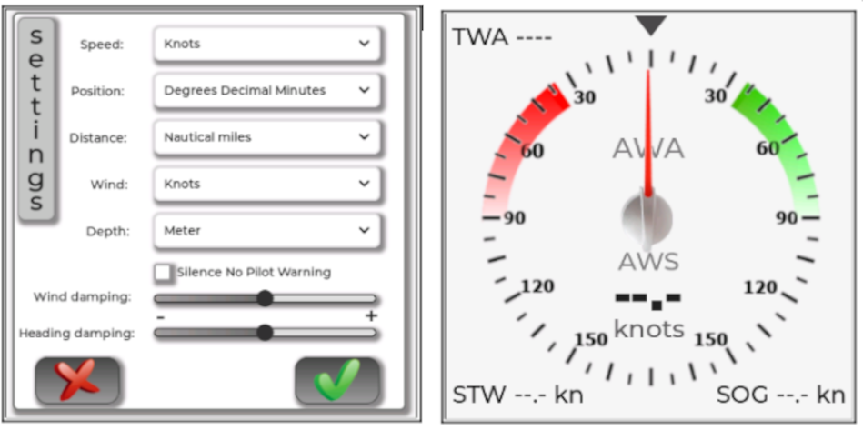

*These are screenshots, so they are not animated and do not show live NMEA2000 values.*

## Why I Built This

My Raymarine ST70 display was no longer functioning correctly. Replacing it with a new one would have cost roughly **€500 to €600**, so I started looking for an alternative. In the end, the only affordable option was to build and program it myself.

My main goals were:

- Keep it affordable
- Create a user interface that was comparable to, or better than, the old Raymarine display
- Avoid a custom PCB
- Avoid soldering if possible

## Hardware

After some searching, I found the **Waveshare ESP32-S3-Touch-LCD-4** board, which includes:

- Integrated CAN bus
- Supply voltage up to 37 V
- A 480 × 480 LCD touchscreen

The board costs about **€35**, and no soldering is required.

**Important:** there are different versions of this board. Make sure the one you buy has the **integrated CAN bus** and is version 4.

The board is delivered without a housing, so I designed a housing for it in **FreeCAD**.

## Software Development

I developed the sketch in the **Arduino IDE**.  
For the user interface, I used **SquareLine Studio**.  
For the NMEA2000 stack, I used the well-known library by **Timo Lappalainen**:

- [Timo Lappalainen on GitHub](https://github.com/ttlappalainen)

After about six months of development, and with a little help from ChatGPT for some routines, I am happy to share the finished project.

## Software Notes

This software uses the ESP32-S3 quite heavily:

- The **NMEA2000 library and decoding logic** run in a FreeRTOS task on **core 0**
- Using core 0 was necessary because the NMEA2000 network can be busy at high data rates
- With a single large sketch running on core 1, I was missing some NMEA2000 messages
- The user interface stores graphical assets in a **9.9 MB FFAT partition**
- At startup, those assets are copied into **PSRAM**
- The normal flash partition for the sketch is too small for all graphics
- PSRAM is much faster than reading graphical assets directly from flash, which improves screen refresh performance

The FFAT-based approach means the graphical assets must be uploaded separately. A small **FFAT uploader sketch** is included for that purpose. You can also use **ESPConnect** instead.

There is also a small auxiliary FreeRTOS task for the onboard beeper. When the beeper routine was integrated directly into the UI sketch using `millis()`, the beeps became irregular because of the screen update load.

### Important for people modifying the code

The LCD on this Waveshare board uses an **RGB interface**, so LCD timing is critical. I fine-tuned the timing values in `lvgl_port_v8.h`. Changing those settings can corrupt the display.

Please also pay close attention to the library versions recommended on the Waveshare wiki:

- [Waveshare ESP32-S3-Touch-LCD-4 Wiki](https://www.waveshare.com/wiki/ESP32-S3-Touch-LCD-4)

This also affects which version of **SquareLine Studio** you can use, because recent versions dropped support for **LVGL 8.4**.

**Modifying this project is not for beginners.**

## Remark on last version of the program:
In the software there is a provision for a board mod. I developped this mod because when i powered my board from the NMEA network it needed a push on the reset button to start.
This mod solves that problem. In the main ino sketch lines 165 and 168 need to be uncommented if you use a modded board.
If you don't encounter the problem i had, there is NO NEED TO MOD THE BOARD.
For more in detail explanations read the file in the pdf documentation folder.

## Easy Method: Flash the Ready-Made Binary

In the repository there is a directory called **`bin file`**. It contains ready-made firmware generated with **ESPConnect**:

- [ESPConnect](https://thelastoutpostworkshop.github.io/ESPConnect/)

Choose the binary that matches your board version (**Version 3** or **Version 4**).
The bin file "Version4 modded" is ONLY to be used if you modded your board (see above and in the pdf documentation folder)

### Flashing with ESPConnect

1. Connect to the ESP32-S3 using the correct USB port.

  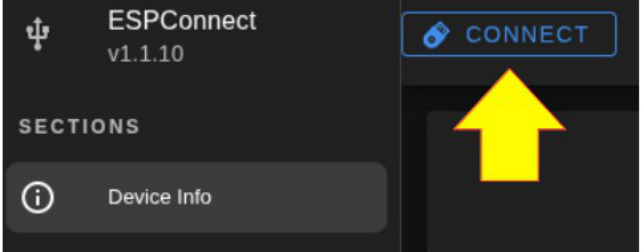

2. Open **Flash Tools**.

  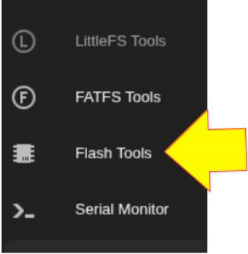

3. In **Flash Firmware**, select the correct `.bin` file from the `bin file` directory.

  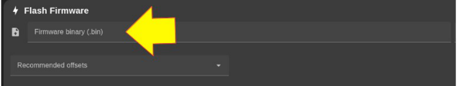

4. Click **Flash Firmware**.

  

That is it. Once flashing is complete, you only need to connect the board to your boat network.

## Build from Source

The source files and libraries are included in their respective folders.

### 1. Load assets into FFAT

The graphical assets from the **`FFAT drive`** inside the **`Squareline Studio`** folder must be uploaded to the FFAT partition on the Waveshare board.

For that, use the helper sketch in the **`FFATuploader`** folder and upload it to your board first.

Then:

- Connect to the Wi-Fi access point **`ESP32S3_FFAT_UPLOAD`**
- Password: **`12345678`**
- Open a browser and go to **`192.168.4.1`**
- In the field labelled **`Doelmap`** (target directory), enter: **`/assets`**
- Click **Browse...**
- Go to the `FFAT drive` folder inside the `Squareline Studio` folder
- Select all files
- Click **Upload**

The upload takes about 20 seconds.

  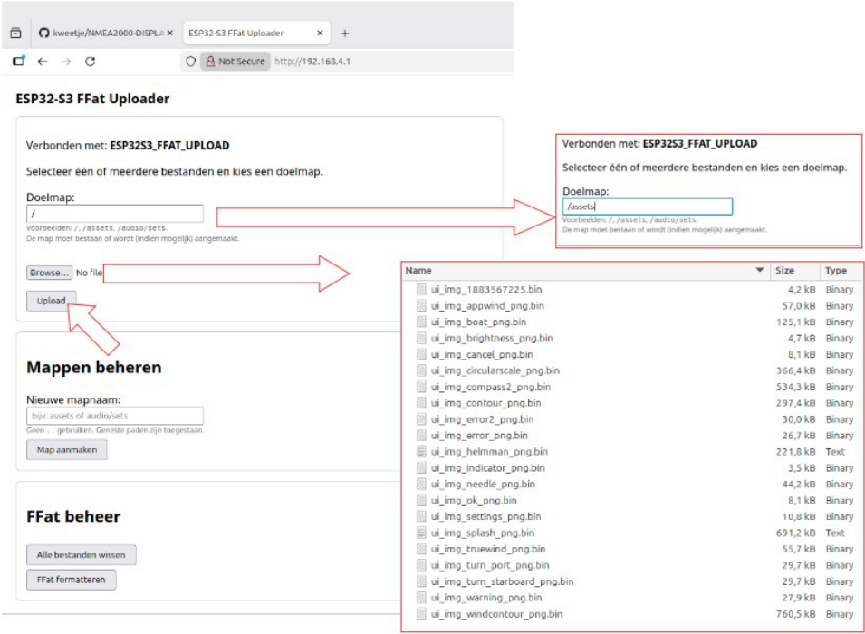

### 2. Compile and upload the sketch in the Arduino IDE

This part is straightforward, but pay attention to the following.

#### Board manager

Use the correct ESP32 board package in the Arduino IDE. In my setup, I used **ESP32 board manager version 3.3.7**.

  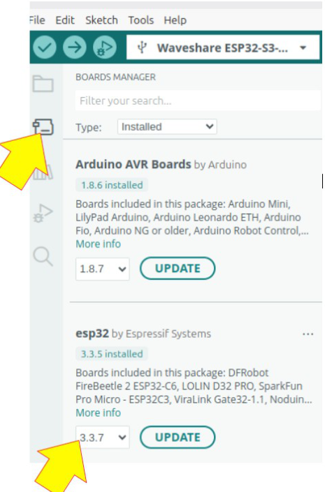

#### Board settings

Use the correct settings for the Waveshare board.

  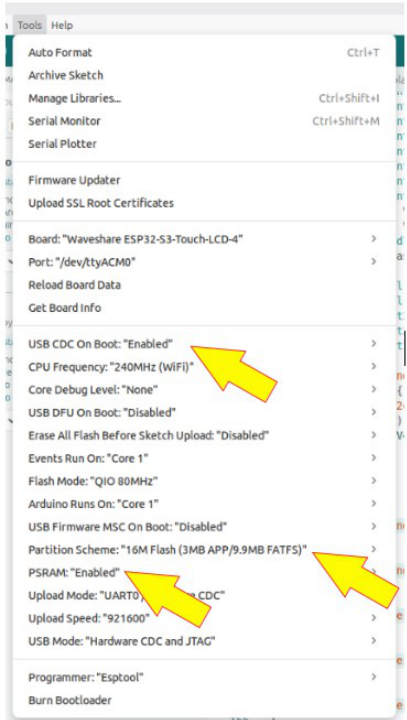

After that, compiling and uploading should work normally.

As a side note: I originally started this project on **Windows 10**, where compilation in the Arduino IDE was painfully slow. After moving to **Linux Mint** in dual boot, compilation became much faster.

## SquareLine Studio Project

The full SquareLine Studio project is included in the **`Squareline Studio`** folder.

If you want to modify it, keep these rules in mind:

- Use **SquareLine Studio 1.5.4**
- Newer versions no longer support **LVGL 8.4**
- This Waveshare board works with **LVGL up to 8.4**
- Later LVGL versions will not work correctly with this board

### SquareLine Studio export settings

Use the following export settings:

  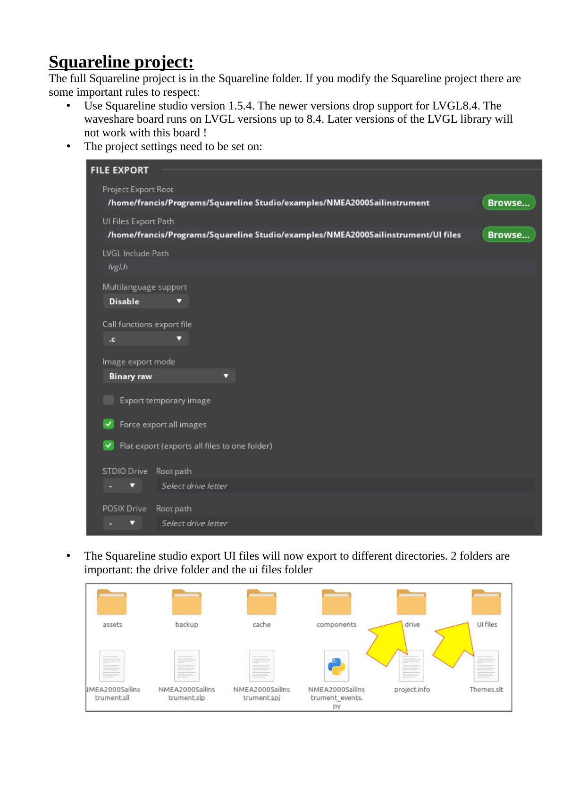

When SquareLine Studio exports the UI, two folders are important:

- the **drive** folder
- the **UI files** folder

  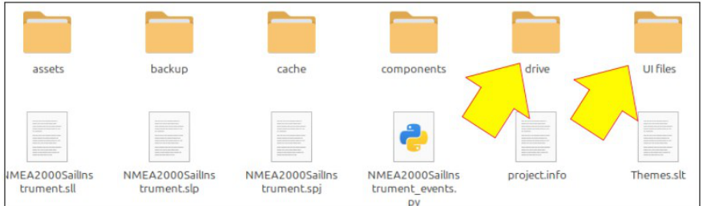

### Important file copy rule

Copy all files from the **`UI files`** folder into the Arduino sketch folder **except**:

- `ui_img_manager.c`
- `ui_img_manager.h`

Those two files are already present in the Arduino sketch folder in modified form so they can work with PSRAM.

  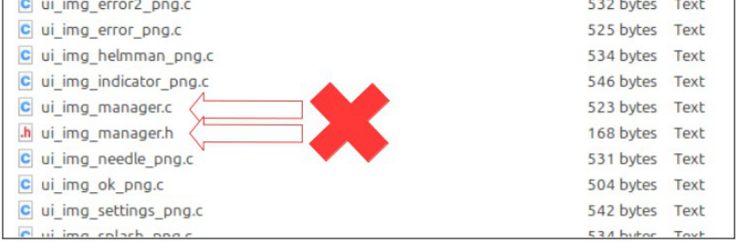

If you add or replace assets, the new assets will be in the **drive** folder. You must upload them again to the FFAT partition as described above. I usually reformat the FFAT partition before uploading updated assets. The FFAT uploader tool includes a button for that.

## Housing

The housing files are included in the **`Freecad`** folder.

The housing was designed in **FreeCAD 1.0**, but the files are also compatible with **FreeCAD 1.1**. Files for direct 3D printing are included as well.

There are mounting holes for **2.5 mm screws**, but I found that it is very easy to crack the LCD glass if the screws are tightened even a little too much. I now glue the display in place instead, which is safer.

## Hardware Connections

Use an NMEA2000 cable and cut it to the desired length.

For **Raymarine Seatalk NG**, the wire colors are:

- **Red** → `Vin`
- **Black** → `GND`
- **White** → `CAN H`
- **Blue** → `CAN L`

  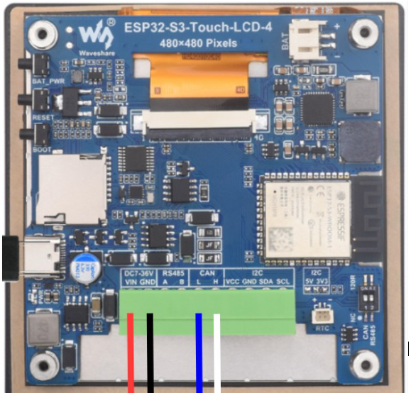

## Contact

If you have problems, or if you need more clarification, please send me an email:

**franciscontact@hotmail.com**

---

> **☕ If you found this project useful, you can support it here:** [Buy Me a Coffee](https://buymeacoffee.com/francissailor)
