# NMEA2000 display with autopilot and alarm handling

Based on the work of:

- Homberger
- Timo Lappalainen

## What to expect?

- A fully working NMEA2000 display comparable to some commercial displays.
- No soldering needed: just connect the NMEA2000 wires and the supply wires (4 wires total) to the terminal block.
- The 3D-printable housing uses the same mounting holes as an ST70 instrument.
- Compatible with Raymarine EVO autopilot and different autopilot modes.
- Displays autopilot-related alarms and allows you to acknowledge them.
- Supports customization of units (knots, km/h, m/s, ft, m, etc.) with a settings screen. Settings are stored in flash.

## What is **not** to be expected?

- The display is not bright enough for outdoor use (350 nits).
- The display is not rugged enough for outdoor use.
- The housing is not watertight and is not designed for outdoor use.

I am trying to negotiate with Waveshare to make a high-NIT board available. At this point they are not interested because I cannot promise firm quantities. If you want to help me (and yourselves) in this negotiation, send a message to Waveshare asking for a high-NIT version of their ESP32-S3-Touch-LCD-4 board by submitting a ticket on the [Waveshare support page](https://www.waveshare.com/wiki/ESP32-S3-Touch-LCD-4#Support).

## What hardware is needed for this project?

- A Waveshare ESP32-S3-Touch-LCD-4 Version 4 board. I have also provided a flash file for V3 boards, but not the source files. I can provide the V3 source files, but some functionality is not available on V3 boards: there is no backlight control, and powering up the board is not automatic because you have to use the power key. Please send me a message if you need the Version 3 source files.
- An NMEA2000 cable that is compatible with your boat network (in my case, a Raymarine SPUR cable).

## You can donate at the top of the github page by clicking the SPONSOR button if you appreciate this program and to help me with my work

## Some screenshots

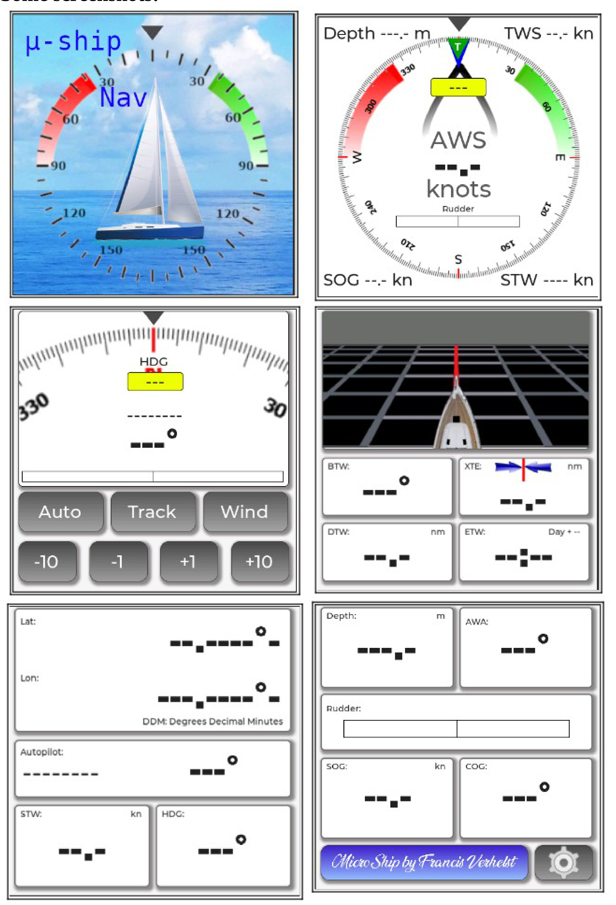

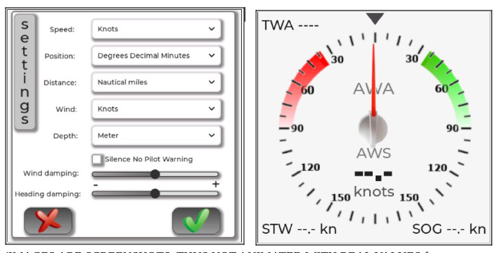

*These are screenshots, so they are static and do not show live animated values from NMEA2000.*

## Introduction

I had a Raymarine ST70 display that was no longer functioning correctly. A new one costs between 500 and 600 euros, so I started looking for an alternative. In the end, I concluded that the only affordable solution was to program it myself.

The main objectives were:

- affordability
- a user interface comparable to, or better than, the old Raymarine unit
- no custom PCB design, and preferably no soldering at all

## Hardware

After searching the internet, I found the Waveshare ESP32-S3-Touch-LCD-4 board with integrated CAN bus, supply voltage up to 37 V, and a beautiful 480 x 480 LCD touch screen. The price is about 35 euros and indeed no soldering at all is needed.

Beware: there are two versions of this board. Check that the one you buy has the integrated CAN bus. The board is delivered without a housing, so I designed a housing for it myself in FreeCAD.

## Software development

I developed the program/sketch with the Arduino IDE. For the UI I used SquareLine Studio. For the NMEA2000 library I used the well-known library of Timo Lappalainen: [github.com/ttlappalainen](https://github.com/ttlappalainen).

After 6 months of programming, and with a little help from ChatGPT for some of the routines, I am proud to share the finalized project. I also included a donation link in the repository if you appreciate my work. My wife hopes I will get rich with my programs. :)

## Software peculiarities

In my opinion, the software uses the full capacity of the ESP32 chip:

- The NMEA2000 library and decoding logic run on an RTOS task on core 0. Using core 0 was necessary because NMEA2000 has a lot of network traffic at high speeds. With the classic approach of writing one huge sketch running on core 1, I missed part of the NMEA2000 traffic.
- The user interface uses a 9.9 MB FATFS partition to store all graphical data. On startup, this data is copied to PSRAM. The reason for this approach is that the normal flash partition for the sketch is too small to contain the graphics data. I also ran into problems with the amount of normal RAM. Using the FFAT partition and PSRAM was the only solution to this, except for using an SD card, which I did not want for reliability reasons.
- Why copy all this data to PSRAM? Although PSRAM is slower than main RAM, it is still much faster than flash memory, which is an important factor in screen refreshes.
- The use of FFATFS means that you need to write the graphical output data to FATFS with a small FFAT uploader sketch. This auxiliary program is included in the download files. Alternatively, you can use [ESPConnect](https://github.com/thelastoutpostworkshop/ESPConnect). More details follow below.
- There is also a small auxiliary task used only for the onboard beeper. When I integrated the beep routine into the user-interface sketch using `millis()`, the beep interval became irregular because of the burden of screen updates on the ESP32. This small RTOS task also runs on core 0.

### For tinkerers

If you want to change or adapt my software, note that the LCD display of this Waveshare board is RGB. This means that timings from the microcontroller to the LCD are critical. I fine-tuned the timings in the `lvgl_port_v8.h` library. Changing these settings may corrupt the display. This is very much a trial-and-error approach.

Please also pay attention to the library versions indicated on the [Waveshare wiki](https://www.waveshare.com/wiki/ESP32-S3-Touch-LCD-4). This also affects the version of SquareLine Studio that you need, because newer versions dropped support for LVGL 8.4.

**Beware: modifying or altering this program is not for beginners.**

## How do you implement this project?

## The easy method

In the files section there is a directory named `bin file`. The binary in that directory was generated by [ESPConnect](https://thelastoutpostworkshop.github.io/ESPConnect/) and can be uploaded directly to the ESP32-S3 board. Choose the file that matches your board version (Version 3 or Version 4).

In ESPConnect:

1. First connect to the ESP32-S3 by choosing the correct USB port.

   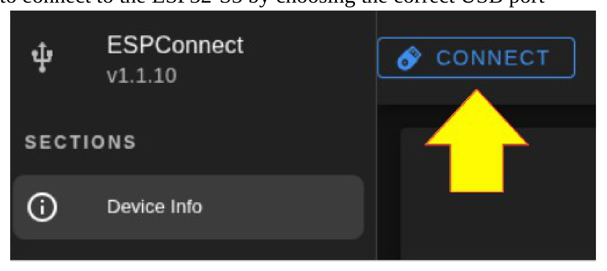

2. Then click **Flash Tools**.

   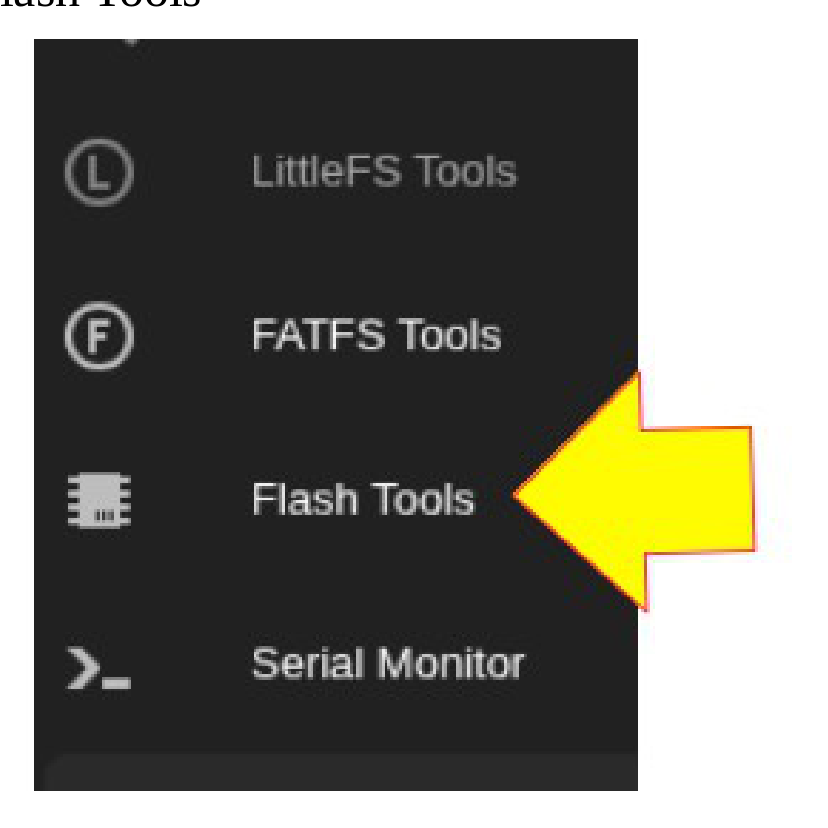

3. In the **Flash Firmware** section, select the firmware binary (`.bin`) and point it to the `bin file` directory in the repository.

   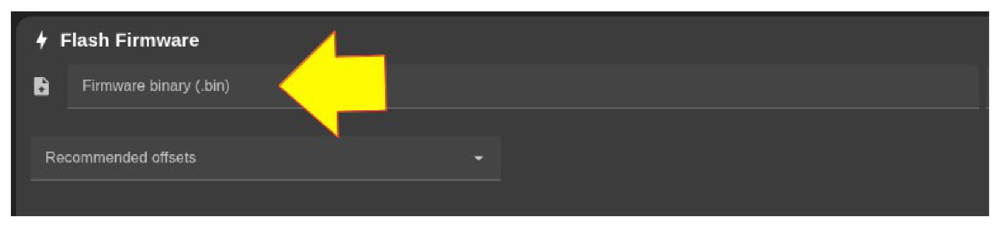

4. Click **Flash Firmware**.

   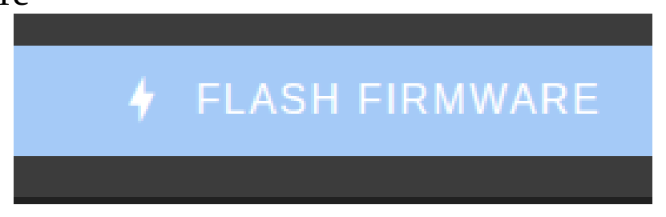

That is it. Your board now has the full program. You only need to connect it to your boat network.

## For the tinkerers

The source files and the libraries used are in their respective folders, but please follow these steps.

### 1. Load assets (image data) to FFAT

First, load all graphical files from the **FFAT drive** inside the **squareline studio** folder to the FFAT partition of the Waveshare board. For this we use the helper program in the `FFATuploader` folder. Compile and upload this sketch to your board.

Then connect to the Wi-Fi access point `ESP32S3_FFAT_UPLOAD` with password `12345678`.

Open a browser window at `http://192.168.4.1`. You will be presented with a simple web interface. Fill in the field for **Doelmap** (target directory in FFAT) with `/assets`.

Now choose the files to upload by clicking **Browse...**. A window will open to allow you to select the files. Go to the directory mentioned above, namely the **FFAT drive** inside the **squareline studio** folder. Select all files and press the **Open** button.

Finally click **Upload**. The upload to the ESP32-S3 will now start. Please be patient; it takes about 20 seconds to complete.

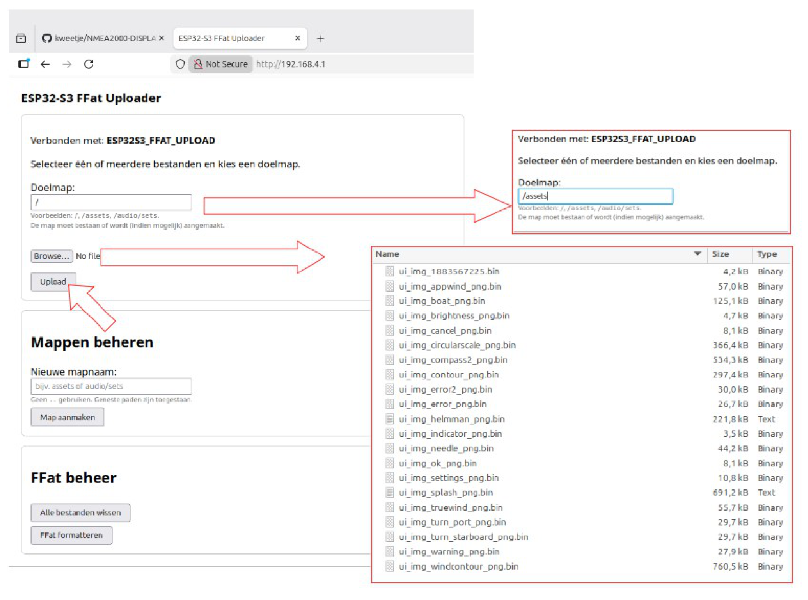

OK, the FFAT is now ready.

### 2. Compile and upload the sketch in the Arduino IDE

This step is straightforward. Only pay attention to the following:

- Choose the correct board in the Arduino IDE. In Board Manager I have the ESP32 board package version **3.3.7** installed.

  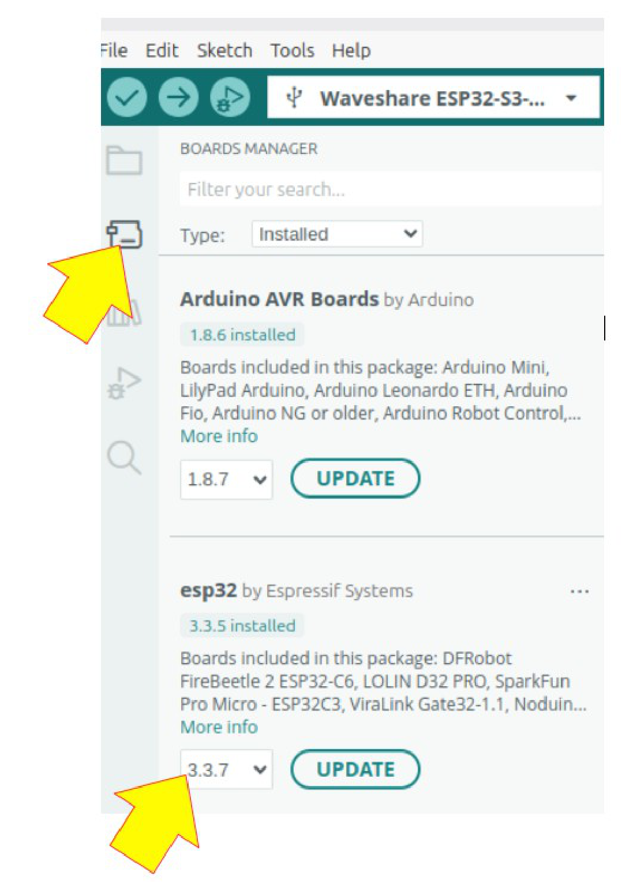

- Choose the correct settings for the Waveshare board.

  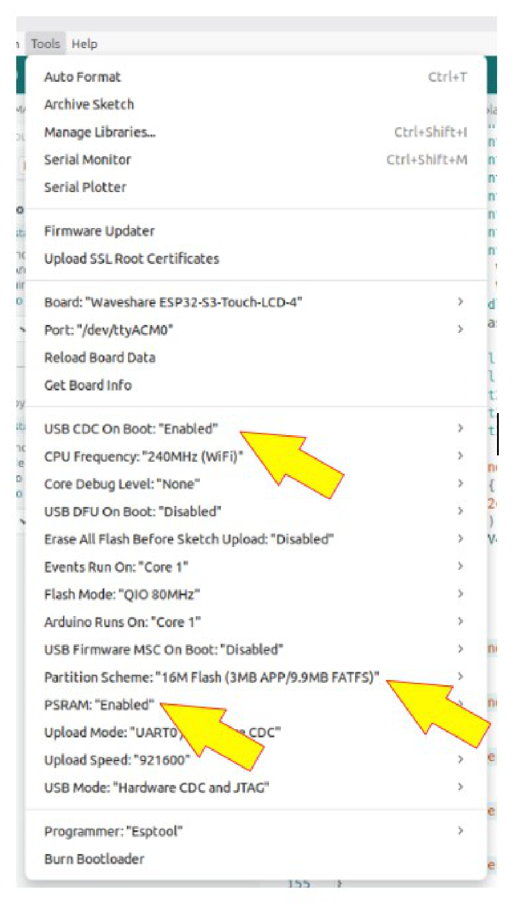

Now compiling and uploading should work fine.

As a side note: I started this project under Windows 10, where the compile speed of the Arduino IDE was painfully slow. After migrating to Linux Mint in dual-boot, I noticed that the compile speed became much faster.

## SquareLine project

The full SquareLine project is in the `Squareline` folder. If you modify the SquareLine project, there are some important rules to respect:

- Use SquareLine Studio version **1.5.4**. Newer versions drop support for LVGL 8.4. The Waveshare board runs on LVGL versions up to 8.4, so later versions of the LVGL library will not work with this board.
- The project settings need to match the screenshot below.

  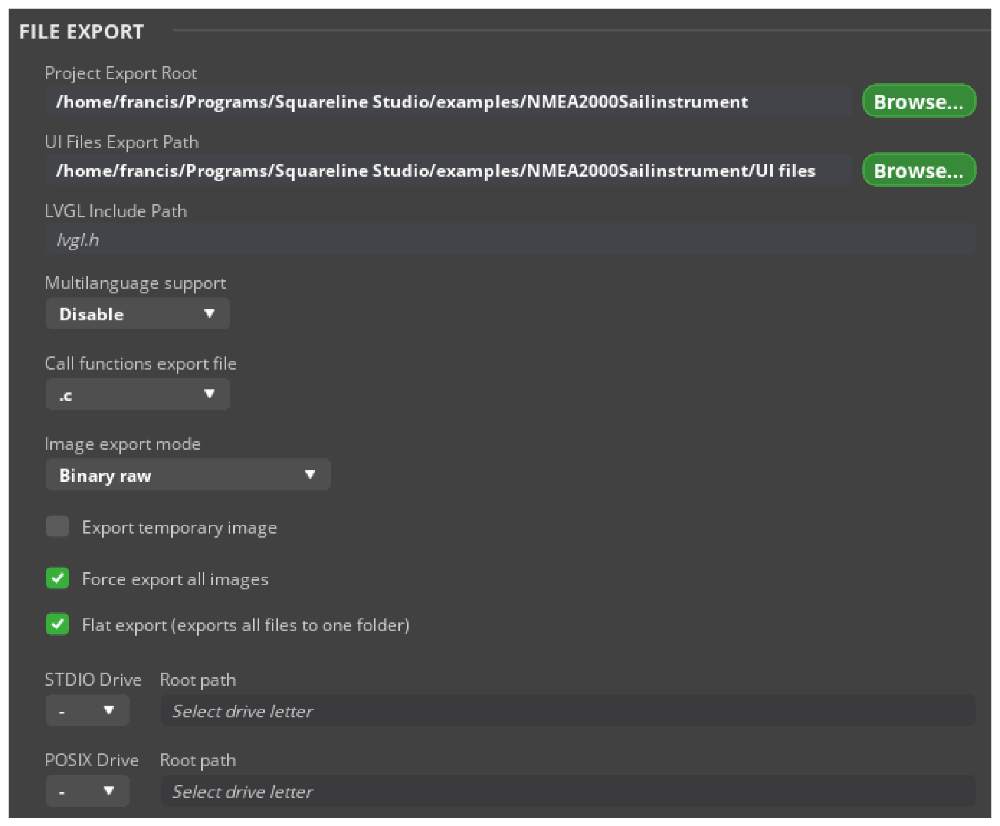

- SquareLine Studio will export UI files to different directories. Two folders are important: the `drive` folder and the `UI files` folder.

  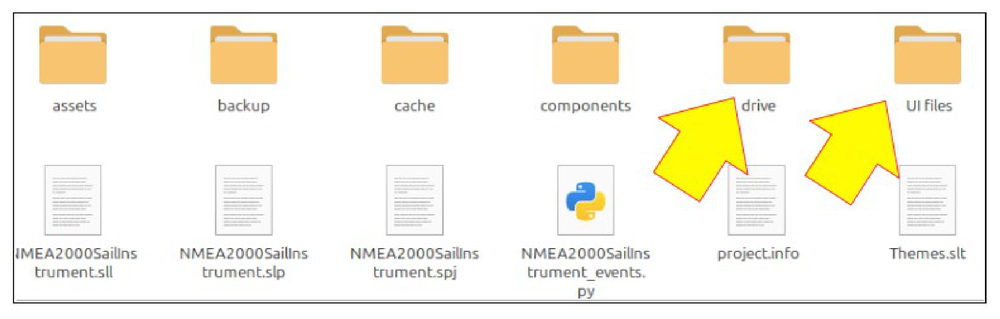

- All files in the `UI files` folder need to be copied to the folder of the Arduino sketch, **except two files**: `ui_img_manager.c` and `ui_img_manager.h`. The correct versions of these two files are already in the Arduino sketch folder. I modified them to take into account that they are in PSRAM.

  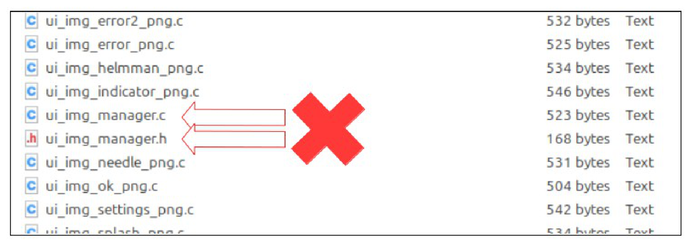

- If you added or replaced any assets, all assets will be in the `drive` folder. You need to upload them to the FFAT partition as described above in **1. Load assets (image data) to FFAT**. I reformat the partition before re-uploading the assets to FFAT; the FFAT uploader tool provides a button for this.

## Housing

There is also a folder for the housing, with the FreeCAD files. The housing was designed with FreeCAD 1.0, but the files are compatible with version 1.1. Files you can use directly for your 3D printer are also included in this folder. There are mounting holes for mounting the display with small 2,5 mm screws, but i noticed it is very easy to crack the glass of the LCD if you tension even only a litle bit too much the screws. I now glue the display in place, which is safer.

## Hardware connections

Use an NMEA2000 cable and cut it to the desired length. For Raymarine SeaTalk NG, the colours are:

- Red to `Vin`
- Black to `GND`
- White to `CAN H`
- Blue to `CAN L`

That is all.

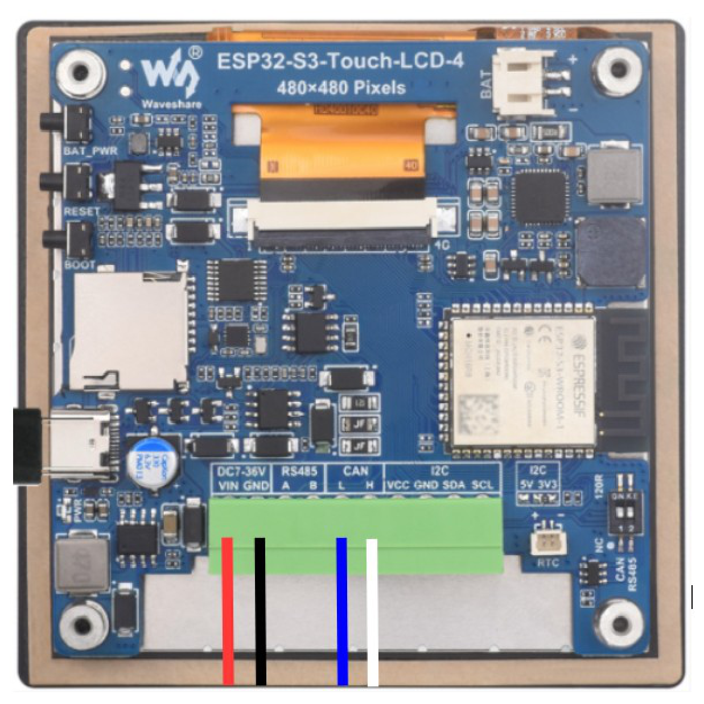

## Contact

If you have problems or need more clarification, please send me an email at [franciscontact@hotmail.com](mailto:franciscontact@hotmail.com).
