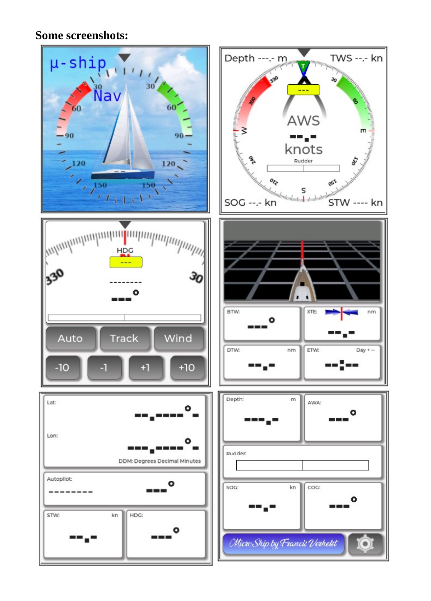
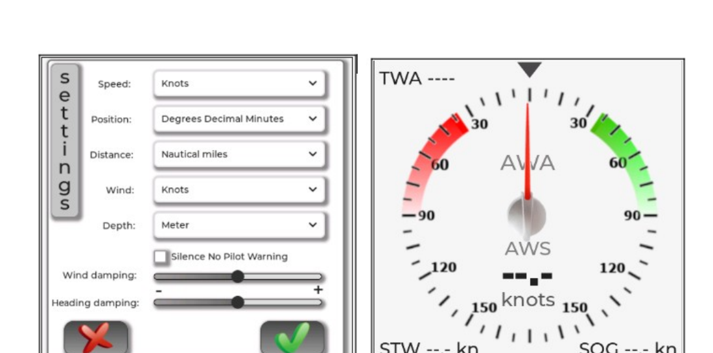
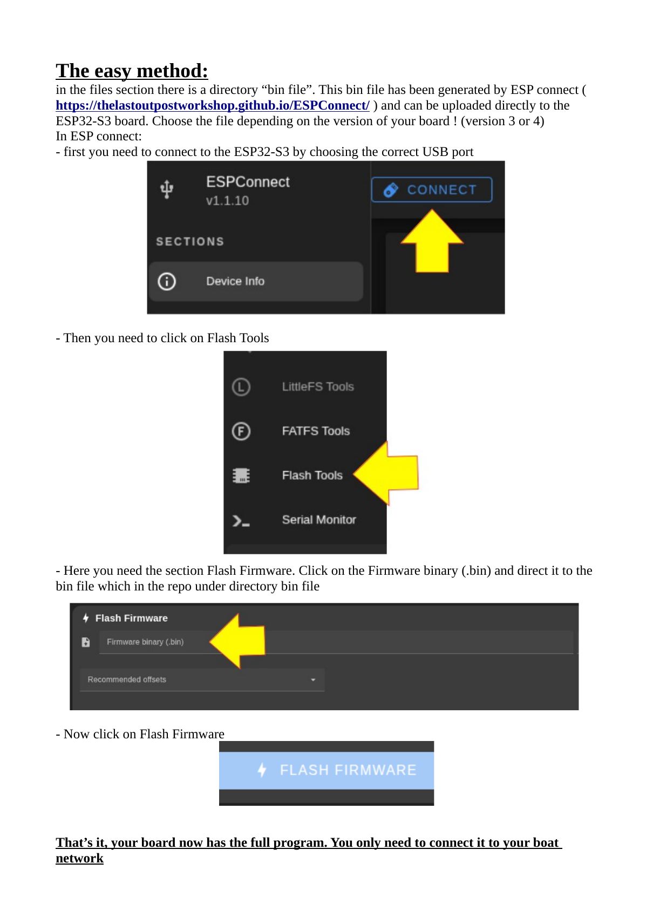
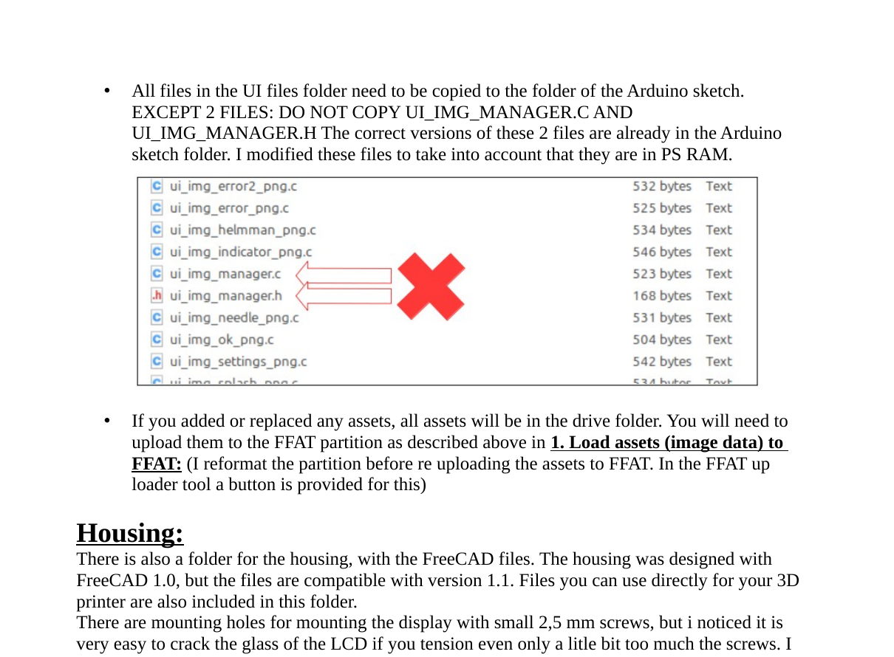

# NMEA2000 Display for ESP32-S3

DIY **NMEA2000 marine display** for the **Waveshare ESP32-S3-Touch-LCD-4**, with **Raymarine EVO autopilot support**, **alarm acknowledgement**, touch UI, and a 3D-printable housing.

Based on the work of **Homberger** and **[Timo Lappalainen](https://github.com/ttlappalainen)**.

If this project helps you, you can support it here: **[Buy Me a Coffee](https://buymeacoffee.com/francissailor)**

---

## Overview

This project was created as an affordable replacement for a failing **Raymarine ST70** display. The goal was to build a practical NMEA2000 display that is easy to assemble, useful on board, and does **not** require a custom PCB or soldering.

### Highlights

- Fully working **NMEA2000 display** for marine instruments
- **Raymarine EVO autopilot** support and autopilot mode display
- **Autopilot alarm handling** with alarm acknowledgement
- **No soldering required**: only 4 wire connections
- Touch-based settings screen with unit selection
- Settings stored in flash memory
- 3D-printable housing with **ST70-compatible mounting holes**

### Limitations

- Display brightness is about **350 nits**, so it is **not ideal for outdoor sunlight**
- The hardware is **not ruggedized for exposed outdoor use**
- The housing is **not waterproof**
- Best suited for **indoor or protected cockpit installation**

---

## Screenshots

### Main screens

### Settings and AWA screen

> These are screenshots, not live animated screens with real-time NMEA2000 values.

---

## Hardware required

### Required parts

- **Waveshare ESP32-S3-Touch-LCD-4, Version 4**
- **NMEA2000 cable** compatible with your boat network

In my setup, I used a **Raymarine Spur cable**.

### Version 3 note

A flash file is available for **Version 3** boards, but not the full source package.

If you need the **Version 3** source files, please contact me. Also note these limitations on V3 boards:

- no backlight control
- the board does not power up automatically
- power-up must be done manually with the power key

### Important board warning

There are multiple versions of the Waveshare board. Make sure the version you buy has the **integrated CAN bus**, otherwise it will not work for this project as intended.

---

## Why this project exists

My original **Raymarine ST70** display was no longer reliable. Replacing it with a commercial product would have cost about **EUR 500 to EUR 600**, so I decided to build an alternative myself.

Main design goals:

- **affordable**
- a user interface comparable to, or better than, the original Raymarine display
- **no custom PCB**
- **no soldering if possible**

The result is this project: a low-cost ESP32-S3-based NMEA2000 display with touch UI, autopilot support, and 3D-printable housing.

---

## Software stack

- **Arduino IDE** for firmware development
- **SquareLine Studio** for the UI design
- **[NMEA2000 library by Timo Lappalainen](https://github.com/ttlappalainen)**
- **FreeCAD** for the housing design

After roughly six months of development, the project reached a stable state that I am happy to share.

---

## Quick start

The easiest way to get the display running is to flash the ready-made binary.

### Easy method: flash the `.bin` file

The repository contains a **`bin file/`** directory with firmware binaries generated using **[ESPConnect](https://thelastoutpostworkshop.github.io/ESPConnect/)**.

Choose the correct binary for your board version (**V3** or **V4**).

### Flashing with ESPConnect

1. Connect the ESP32-S3 board to your computer by USB.
2. Open **ESPConnect**.
3. Select the correct USB port.
4. Open **Flash Tools**.
5. In **Flash Firmware**, browse to the correct `.bin` file in the `bin file/` directory.
6. Click **Flash Firmware**.
7. After flashing, connect the board to your boat network.

---

## Build from source

For people who want to modify the code or UI, the full source files and supporting folders are included.

### Important technical notes

The software pushes the ESP32-S3 quite hard:

- The **NMEA2000 decoding logic** runs in an **RTOS task on core 0**.
- This was necessary because high NMEA2000 traffic caused missed messages in a classic single-loop sketch.
- UI graphics are stored in the **FFAT/FATFS partition** and copied to **PSRAM** at startup.
- This approach was needed because the sketch partition and standard RAM were not large enough for the graphics.
- A separate RTOS task handles the onboard **beeper** for more regular alarm timing.

### Warning for developers

This project is **not beginner-friendly** to modify.

The display is driven over **RGB timing**, so the timing values in `lvgl_port_v8.h` are important. Incorrect settings may corrupt the display.

Also pay attention to:

- the library versions recommended on the **[Waveshare wiki](https://www.waveshare.com/wiki/ESP32-S3-Touch-LCD-4)**
- the **LVGL 8.4** requirement
- SquareLine Studio version compatibility

---

## Source build steps

### 1. Upload UI assets to FFAT

All graphical asset files from the **FFAT drive** inside the **SquareLine Studio** project must be uploaded to the FFAT partition on the Waveshare board.

Use the helper sketch in the **`FFATuploader/`** folder.

#### FFAT upload procedure

1. Compile and upload the **FFAT uploader** sketch to the board.
2. Connect to the ESP32-S3 Wi-Fi access point:
   - **SSID:** `ESP32S3_FFAT_UPLOAD`
   - **Password:** `12345678`
3. Open a browser and go to: `http://192.168.4.1`
4. In the **Doelmap** field, enter: `/assets`
5. Click **Browse...** and select **all files** from the `drive` / FFAT asset folder in the SquareLine Studio project.
6. Click **Upload**.

The upload takes roughly **20 seconds**.

### 2. Compile and upload the Arduino sketch

This part is straightforward, but check the following carefully:

- select the correct **Waveshare ESP32-S3** board in the Arduino IDE
- use **ESP32 board package version 3.3.7**
- use the correct Waveshare board settings

#### Arduino board manager

#### Recommended board settings

Once those settings are correct, compiling and uploading should work normally.

> Side note: compile times were much faster for me on Linux Mint than on Windows 10.

---

## SquareLine Studio notes

The full SquareLine Studio project is included in the **`Squareline Studio/`** folder.

### Required version

Use **SquareLine Studio 1.5.4**.

Newer versions dropped support for **LVGL 8.4**, which this Waveshare setup depends on.

### Export settings

Configure the project export settings as shown below.

The two important output folders are:

- **drive**
- **UI files**

### Important warning about exported UI files

Copy **all files** from the `UI files` folder into the Arduino sketch folder **except**:

- `ui_img_manager.c`
- `ui_img_manager.h`

Those two files are already present in the Arduino sketch and were modified to work correctly with **PSRAM**.

If you add or replace image assets, the updated files will appear in the **drive** folder. Upload them again to FFAT as described above.

---

## Housing

The **`Freecad/`** folder contains the housing design files.

- designed in **FreeCAD 1.0**
- also compatible with **FreeCAD 1.1**
- printable files for 3D printing are included

The housing uses the same mounting hole pattern as a **Raymarine ST70**.

### Practical note

I originally used small **2.5 mm screws**, but it is very easy to crack the LCD glass if the screws are tightened even slightly too much.

I now **glue the display in place**, which I consider safer.

---

## Hardware connections

Wiring is simple: use a compatible **NMEA2000 cable** and cut it to the required length.

For **Raymarine SeaTalk NG**, the wire colors are:

- **Red** -> `Vin`
- **Black** -> `GND`
- **White** -> `CAN H`
- **Blue** -> `CAN L`

---

## Repository contents

Typical folders in this project:

- **`src/`** - Arduino source code
- **`bin file/`** - ready-to-flash firmware binaries
- **`Squareline Studio/`** - UI project and exported assets
- **`Freecad/`** - enclosure design files
- **`images/`** - README images and screenshots
- **`pdf documentation/`** - additional documentation

---

## Support

If this project is useful to you and you want to help support future improvements, you can use:

- **[Buy Me a Coffee](https://buymeacoffee.com/francissailor)**

---

## Contact

If you need more information or run into problems, contact me at:

**franciscontact@hotmail.com**
